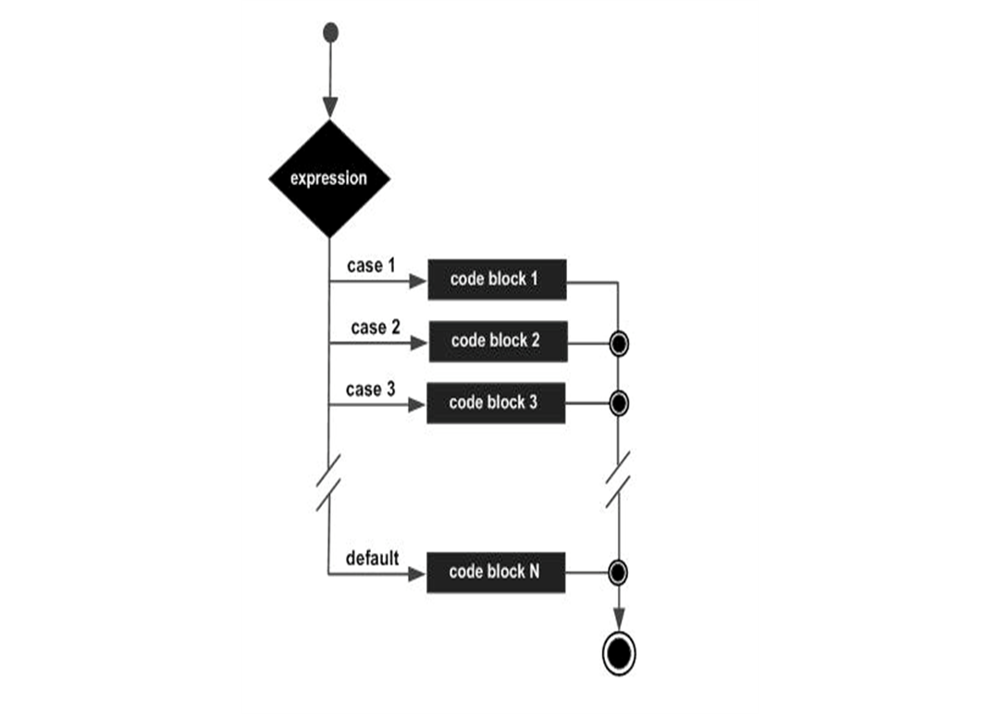

### Оператор switch
***
#### В отличие от операторов if и if else, оператор switch может иметь несколько возможных путей выполнения.
	Оператор switch работает с int и char.

Синтаксис:     
`switch(выражение) {   
case значение :       // Операторы       
break;      
...     
default : // Необязательно       // Операторы   
}`

**Диаграмма потока**

#### Синтаксис оператора switch
Каждый оператор break завершает выполнение соответствующего оператора switch.     
Операторы break необходимы, потому что без них операторы в блоках switch будут выполняться подряд: Все операторы после подходящей метки case выполняются последовательно, независимо от выражения последующих меток case, до тех пор, пока не будет встречен оператор break.     
Оператор default не обязателен, но он должен находиться в конце оператора switch.

**Следующий пример – это программа, которая отображает месяц, соответствующий целому числу месяца.**